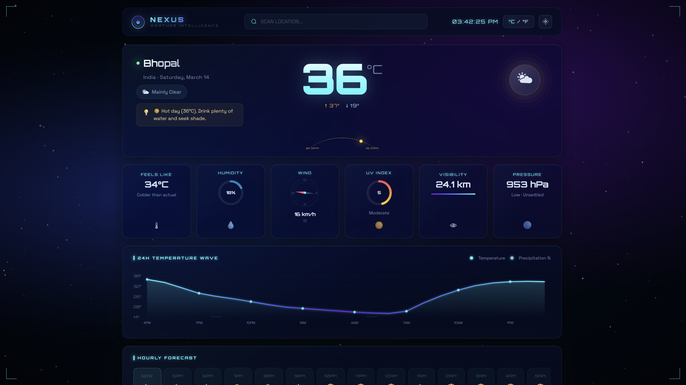

# NEXUS Weather App 🌤️

**A modern, responsive weather dashboard for searching real-time weather data by city.**

---

## 🚀 Live Demo

Preview the app online:

https://nexus-ashen-eight.vercel.app

---

## 🧩 Project Overview

NEXUS Weather App is a frontend web application that enables users to search for any city and instantly view current weather conditions. The interface is clean, responsive, and designed for speed — delivering temperature, humidity, wind speed, and weather conditions with intuitive icons.

---

## 🖼️ Screenshots



> Add your own screenshots in the `screenshots/` folder and update the links above.

---

## ✨ Features

- 🔍 Search weather by city name
- 🌡️ Display real-time temperature, humidity, and wind speed
- 🧭 Weather condition icons
- 📱 Responsive modern user interface (mobile + desktop)
- ⚠️ Error handling for invalid city names
- ⚡ Fast loading and smooth UX

---

## 🧰 Tech Stack

- **HTML5**
- **CSS3**
- **JavaScript (ES6+)**
- **OpenWeatherMap API**

---

## 🛠️ Installation

1. **Clone the repository**

```bash
git clone https://github.com/aryan-mod/nexus-weather-app.git
cd nexus-weather-app
```

2. **Install dependencies (if any)**

This is a vanilla frontend project, so there are no additional dependencies required.

---

## ▶️ Run Locally

1. Open `index.html` in your browser.

> ✅ For the best experience, use a local web server (recommended):

```bash
# Using Python 3
python -m http.server 8000
```

Then navigate to:

```
http://localhost:8000
```

---

## 🌐 API Used

This project uses the **OpenWeatherMap API** to fetch real-time weather data. It provides current weather information such as temperature, humidity, wind speed, and condition icons.

You can sign up for a free API key here:

https://openweathermap.org/api

In the app, update the API key in `app.js` (or the appropriate config section) to make real requests.

---

## 🗂️ Project Structure

```
weather-app/
├── app.js
├── index.html
├── style.css
└── README.md
```

---

## 🚧 Future Improvements / Roadmap

- ✅ Add search suggestions / autocomplete
- ✅ Save favorite cities to local storage
- ➕ Add multi-day forecast view
- 📌 Add dark/light theme toggle
- 🌍 Add geolocation to auto-detect current city
- 🧪 Add unit tests and CI integration

---

## 🤝 Contribution

Contributions are welcome! Follow these steps to get started:

1. Fork the repository
2. Create a feature branch:

```bash
git checkout -b feature/your-feature-name
```

3. Commit your changes:

```bash
git commit -m "feat: add <feature>"
```

4. Push to your branch:

```bash
git push origin feature/your-feature-name
```

5. Open a Pull Request and describe what you changed.

---

## 🧑‍💻 Author

**Aryan Kushwaha** - [https://github.com/aryanKDev](https://github.com/aryanKDev)

---

## 📄 License

This project is open source and available under the **MIT License**. See the [LICENSE](LICENSE) file for details.
